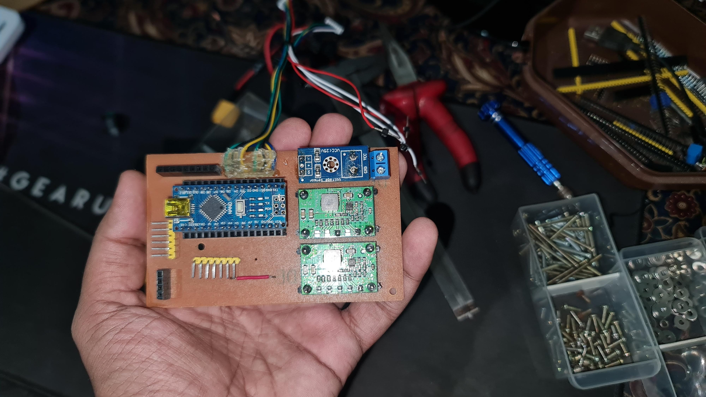

# 🌈 Color Arrow Following Robot

**SLTC - Technology Challenge Competition 2**

## 📜 Description
The **Color Arrow Following Robot** is an autonomous robot designed to identify its direction based on arrows using image processing. The camera detects the arrow, and the robot follows its direction accordingly.

## ✨ Features
- **Accurate Direction Identification**: Detects the direction of arrows with precision. 🧭
- **Custom PCB**: Developed a homemade PCB to connect hardware components with Arduino Nano (designs available in the `Designs` folder). 🔌
- **Custom Chassis**: Designed using Adobe Illustrator and laser-cut from a 2mm acrylic sheet. 🛠️
- **IoT Capabilities**: Integrated with Blynk to display:
  - Raspberry Pi CPU usage 📊
  - Memory usage 🗄️
  - Disk usage 💽
  - Temperature 🌡️
  - IP address and SSID of the connected network 🌐
  - Identified direction of the robot 🛤️
  - Voltage and LDR value ⚡
- **Advanced Arrow Identification Algorithm**: Utilizes OpenCV to detect edges, calculate distances, and determine orientation (up, down, left, right) based on the lowest distance points. 🔍

## ⚙️ Technologies Used
- **Programming Languages**: Python 🐍
- **Libraries**: OpenCV, NumPy, PySerial 📚
- **Hardware**: Arduino, Raspberry Pi 🖥️
- **IoT Platform**: Blynk 🌐
- **Additional Technologies**: Python Pipeline, Threading 🛠️

### 🔧 Prerequisites
- Arduino IDE
- Raspberry Pi with a camera module

### 🏗️ Steps Instructions

1. **Clone the Repository**:
     ```bash
     git clone https://github.com/PasinduSahan001/Color_Arrow_Following_Robot.git

2. **Upload the Arduino Code**:<br/>&ensp;&ensp;Use the Arduino IDE to upload the Arduino code to the Arduino board.

3. **Set Up the Raspberry Pi**:<br/>&ensp;&ensp;Navigate to the Python folder and set up a virtual environment:
   ```bash
   cd Python
   ```
   ```
   python3 -m venv venv
   ```
   ```
   source venv/bin/activate
   ```
4. **Install Required Python Packages**:<br/>&ensp;&ensp;For OpenCV installation, follow the steps shown in this video: [Video Demonstration](https://www.youtube.com/watch?v=QzVYnG-WaM4)

5. **Then, install the additional necessary Python packages using pip**:
    ```bash
    pip install numpy pyserial picamera2 BlynkLib
    ```

6. **Run the Scripts: Execute the following scripts in order**:
    ```bash
    python Serial_Handler.py
    ```
    ```
    python Identifier.py
    ```
    ```
    python Blynk.py
    ```
### 🖼️ Images and Screenshots
Please refer to the included screenshots that showcase the hardware, image processing results and Blynk interface.<br/>
<br/>





### 🚀Project Completion
This project is designed for a group of five members, but I completed it independently. 🎉
